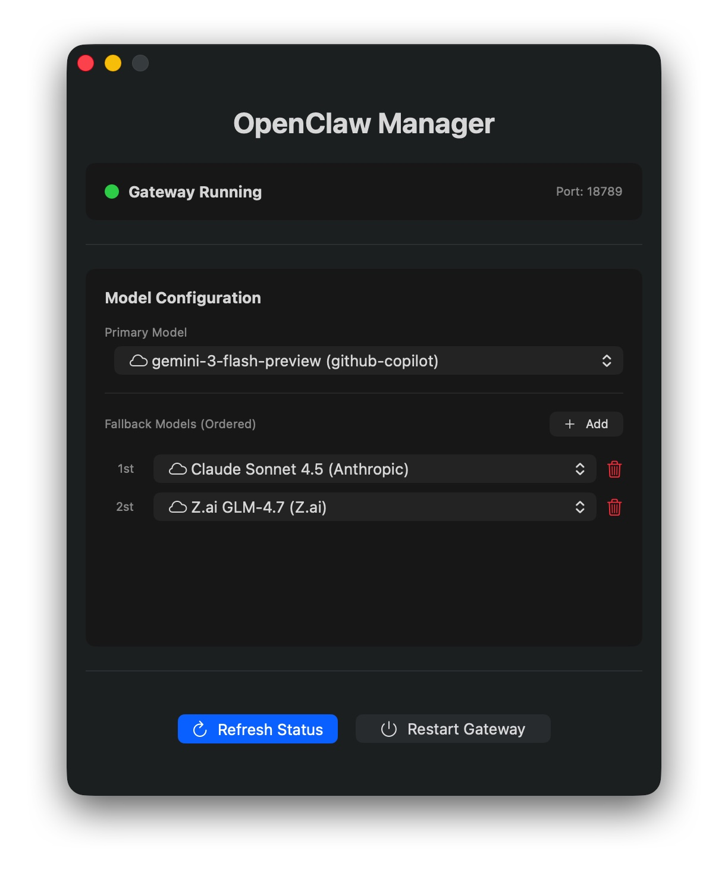

# OpenClaw Manager

A native macOS menu bar application for managing your **OpenClaw Gateway**.


<p align="center">
  
</p>

## Screenshot
<p align="center">
  
</p>

## Features
- **Gateway Status**: Real-time status indicator (Running/Stopped) for your local OpenClaw Gateway.
- **Port Detection**: Automatically detects if the configured port (default `18789`) is active.
- **Model Configuration**:
  - Select Primary Model.
  - Configure Ordered Fallback Models with priority (1st, 2nd, etc.).
  - Deduplicates models and shows Provider names (e.g., Anthropic vs AWS).
- **Controls**:
  - Restart Gateway.

## Installation

### Download
Go to the [Releases](../../releases) page and download the latest `OpenClawManager.dmg`.
1. Open the `.dmg` file.
2. Drag `OpenClawManager` to your **Applications** folder.
3. Launch the app.

### Build from Source
If you prefer to build it yourself:

```bash
# Clone the repository
git clone https://github.com/tiger-dreams/openclaw-gateway-manager.git
cd openclaw-gateway-manager

# Build and Install
./package.sh
```
This will generate `OpenClawManager.dmg` in the project root.

## Configuration
The app looks for configuration in:
1. `~/.openclaw/openclaw.json` (Recommended)
2. `~/.moltbot/openclaw.json`

## Troubleshooting

### "App is damaged and can't be opened"
If you see this message when launching the app, it's due to macOS Gatekeeper security. To fix it:

1. Move `OpenClaw Manager.app` to your **Applications** folder.
2. Open **Terminal**.
3. Run the following command:

```bash
xattr -cr /Applications/OpenClawManager.app
```

